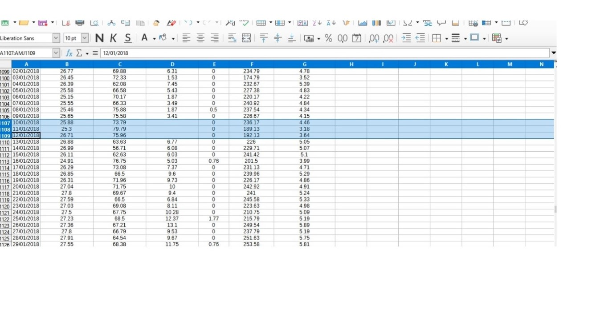
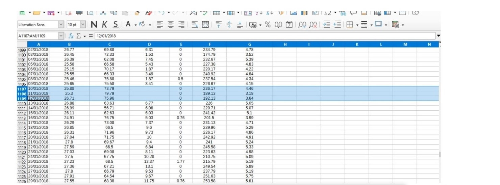
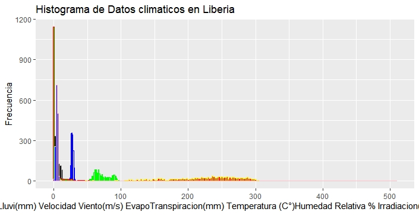
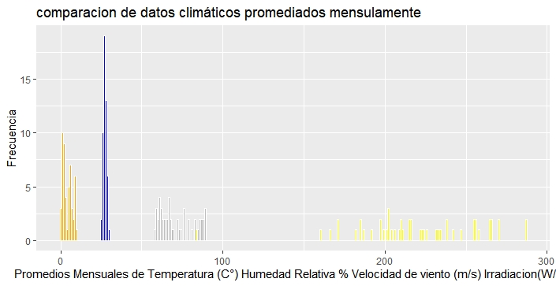
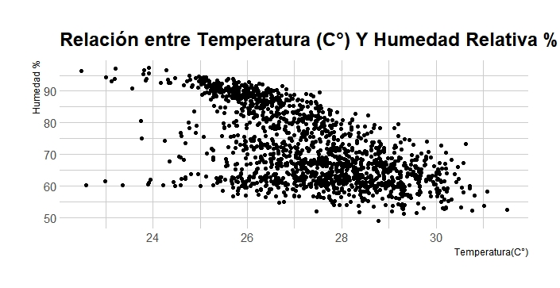
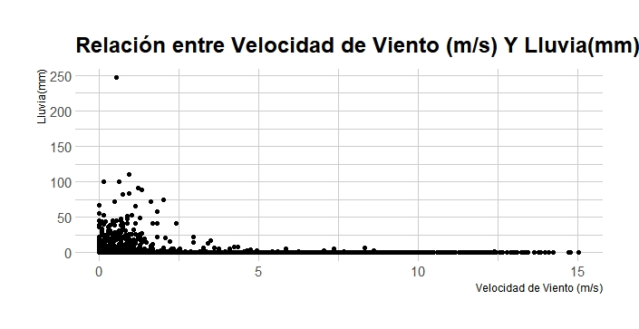
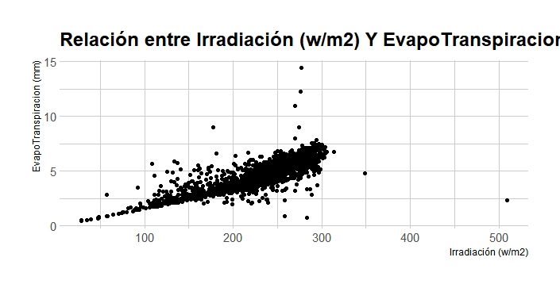

# Proyecto I: Visualización de datos climáticos

### 1. Limpiar Base de Datos
Se buscan celdas vacías (NA), de manera exhaustiva en el archivo ya importado en Rstudio con los comandos:  
View(inp)     
Y también de manera manual, viendo todos los datos y se encontraron celdas Vacías, las cuales se eliminaron y posteriormente se subió el archivo en CSV.  

  
 
#### Figura 1 y 2. Datos con celdas Vacías  (NA)

Y se eliminaron 25 datos nulos o vacios.
Se nombra el Archivo CSV por inp y se visualiza sus dimensiones y estrutura:

inp <- read.csv("Liberia_datos climaticos.csv", na.strings="")
head(inp)  
dim(inp)  
str(inp)  
 

### 2. Grafico 1. Histograma de Datos Climáticos de Liberia con todas sus variables. 

Se hace un histograma de los datos con las 6 variables un panel cada una, pero igualmente se traslapan:

ggplot(inp) +  
geom_histogram(  
aes(x = Temperatura..Celsius.),   
                 binwidth = 1,  
                 color = "blue",  
                 fill = "white") +   
  geom_histogram(   
    aes(x = HumedadRelativa....    ),  
                 binwidth = 1,  
                 color = "green",]  
                 fill = "grey") +  
  geom_histogram(    
    aes(x = VelocidadViento..m.s.  ),    
    binwidth = 2,  
    color = "grey",    
    fill = "black") +    
  geom_histogram(  
    aes(x = Lluvia..mm.            ),  
    binwidth = 2,   
    color = "red",  
    fill = "green") +  
  geom_histogram(  
    aes(x = Irradiacion..W.m2.     ),  
    binwidth = 2,   
    color = "yellow",  
    fill = "red") +   
  geom_histogram(  
    aes(x = EvapoTranspiracion..mm.),   
    binwidth = 2,  
    color = "pink",    
    fill = "blue") +  
  ggtitle("Histograma de Datos climaticos en Liberia") +  
  xlab("Lluvi(mm) Velocidad Viento(m/s) EvapoTranspiracion(mm) Temperatura (C°)Humedad  
Relativa % Irradiacion(W/m2)  ") +  
  ylab("Frecuencia")  
  
  
  
    
####Figura 3. Histograma de datos climáticos de Liberia.

### 3. Se promedian las series de temperatura, humedad relativa, velocidad de viento, irradiación a valores mensuales 

ggplot(promedios) +
  geom_histogram(
    aes(x = Temperatura..Celsius..1), 
    binwidth = 1,
    color = "white",
    fill = "blue") + 
  geom_histogram(
      aes(x = HumedadRelativa.....1  ),
      binwidth = 1,
      color = "white",
      fill = "grey") +  
  geom_histogram(
        aes(x = VelocidadViento..m.s..1), 
        binwidth = 1,
        color = "white",
        fill = "orange") +
  geom_histogram(
    aes(x = Irradiacion..W.m2..1   ),
    binwidth = 1,
    color = "white",
    fill = "yellow") +
  ggtitle("comparacion de datos climáticos promediados mensulamente") +
  xlab("Promedios Mensuales de Temperatura (C°) Humedad Relativa % Velocidad de viento (m/s) Irradiacion(W/m2") + 
  ylab("Frecuencia")

   
####figura pregunta 3

### 4.gráficos x-y 
Se relacionan las variables entre sí:

ggplot(inp, aes(x =Temperatura..Celsius.  )) +
  geom_point(aes(y = HumedadRelativa....    )
  ) +
  ggtitle("Relación entre Temperatura (C°) Y Humedad Relativa %") +
  xlab("Temperatura(C°)") +
  ylab("Humedad %") +
  theme_ipsum()
  
  
  
  
  
#### Figura pregunta 4 1.2 y3

